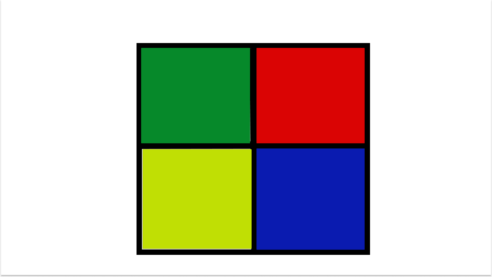

# Game-Project Memory Match

This is my game project for V9 cohort 

# MVP
*Minimum Viable Product*
- Game Interface
- Functionality
- Start Button
- Round Indicator
- Four buttons for users to interact with
- Flashing colors to indicate pattern to users 
- Score Indicator 

# PMVP
 *Post Minimum Viable Product*
- change button shapes from square to more of a rounded shape

# Wireframes

# Instructions
- Press the start game button.
- The game will display a sequence of colors.
- You must match the sequence of colors by clicking on the corresponding buttons .
- If you match correctly a new pattern will be added.
- If you make a mistake , restart the game by clicking the start game button.
- Enjoy!

# License

Copyright (c) 2023 shawnmbailey

Permission is hereby granted, free of charge, to any person obtaining a copy
of this software and associated documentation files (the "Software"), to deal
in the Software without restriction, including without limitation the rights
to use, copy, modify, merge, publish, distribute, sublicense, and/or sell
copies of the Software, and to permit persons to whom the Software is
furnished to do so, subject to the following conditions:

The above copyright notice and this permission notice shall be included in all
copies or substantial portions of the Software.

THE SOFTWARE IS PROVIDED "AS IS", WITHOUT WARRANTY OF ANY KIND, EXPRESS OR
IMPLIED, INCLUDING BUT NOT LIMITED TO THE WARRANTIES OF MERCHANTABILITY,
FITNESS FOR A PARTICULAR PURPOSE AND NONINFRINGEMENT. IN NO EVENT SHALL THE
AUTHORS OR COPYRIGHT HOLDERS BE LIABLE FOR ANY CLAIM, DAMAGES OR OTHER
LIABILITY, WHETHER IN AN ACTION OF CONTRACT, TORT OR OTHERWISE, ARISING FROM,
OUT OF OR IN CONNECTION WITH THE SOFTWARE OR THE USE OR OTHER DEALINGS IN THE
SOFTWARE.